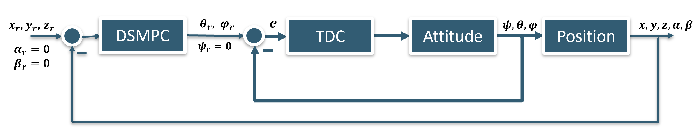
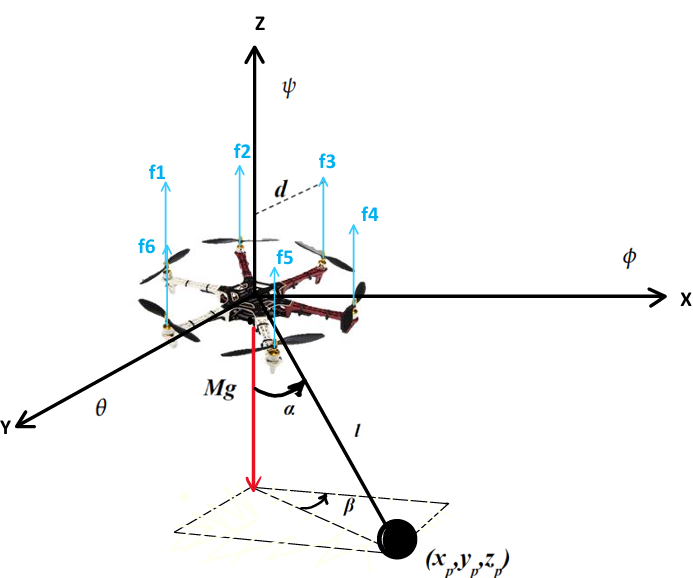

# Data-Driven Control for Aerial Transportation of Suspended-Cable Payloads Using a Hexacopter

This repository contains simulations and models for the control of a **hexacopter carrying a suspended payload** using **Data-Driven Sliding Model Predictive Control (DSMPC)** and **Data-Driven Adaptive Control** combined with a backstepping-based inner loop.

> **Note:** All code was developed and tested using **MATLAB R2024**.

---

## Control Structure

The high-level control structure is shown below:

- **DSMPC** – Outer loop controller for position and swing suppression  
- **TDC (Time-Delayed Control)** – Compensates model uncertainties and disturbances  
- **Attitude** – Inner loop using backstepping control  
- **Position** – UAV and suspended load dynamics

Feedback is provided from **Position** and **Attitude** to both controllers.

---

## UAV-LOAD Dynamic Model

The hexacopter with a suspended payload is shown below:

The hexacopter–load system is modeled using an 8‑dimensional state vector:

q = [ ξ  η  μ ]ᵀ ∈ R⁸

where:

1. **Linear positions**  
   ξ = [x, y, z]ᵀ ∈ R³  
   represent the UAV position in the inertial frame.

2. **Angular positions**  
   η = [ψ, θ, φ]ᵀ ∈ R³  
   correspond to the UAV’s yaw (ψ), pitch (θ) and roll (φ).

3. **Swing angles**  
   μ = [α, β]ᵀ ∈ R²  
   describe the motion of the suspended payload with respect to the cable:
   - α: swing angle (forward–backward)
   - β: azimuth angle of the swing direction.

The control inputs consist of:
- Input torques τ = [τψ, τθ, τφ]ᵀ
- Thrust vector u = [ux, uy, uz, t]ᵀ

where ux, uy, uz are the components of the total thrust vector u₁, and:

u₁ = f₁ + f₂ + f₃ + f₄ + f₅ + f₆

corresponds to the sum of all six rotor forces.

This formulation captures the coupled dynamics between UAV translation,
attitude, and payload swing, as illustrated in the figure above.

The dynamic model equations of the hexacopter-load system are described in:

[Slung Load Hexacopter Model PDF](model.pdf)

(Click the link above to open the PDF.)

The load swing angles are modelled using spherical coordinates.
The system parameters have been referenced from [MDPI Mathematics 9(15):1822](https://www.mdpi.com/2227-7390/9/15/1822).

---
## Controller Folders

This repository contains two folders:

- **Data-Driven Adaptive Control**  
- **Data-Driven Sliding Model Predictive Control**  

Each folder contains the MATLAB scripts and functions necessary to simulate the respective control approach.

---
## How to Use

- Run the MATLAB scripts for simulation.
- Results are visualized in MATLAB plots.

---

## References

If you use these materials, please cite:

> *Data-Driven Control for Aerial Transportation of Suspended-Cable Payloads Using a Hexacopter*  
> Yagut Badalova, 2025

---

## Repository Contents

### Folder Structure

- Data-Driven Adaptive Control/
  - Backstepping_InnerLoop.m
  - DataDriven_AC.m
  - HexacopterModel.m

- Data-Driven Sliding Model Predictive Control/
  - Backstepping_InnerLoop.m
  - DataDriven_SMPC.m
  - HexacopterModel.m
  - smpc_alpha.mat

- `model.pdf` – Dynamic model equations
- `Control_structure.png` – Control structure diagram
- `system.png` – System configuration figure
- `README.md` – This documentation